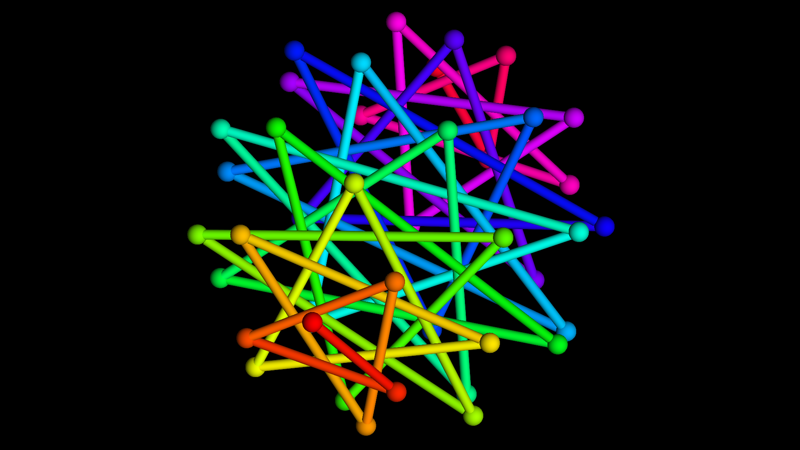

# [Basic Geometry Renderer](https://clementcariou.github.io/Basic-Geometry-Renderer/build.html)

Simple REGL point and line renderer using one quad per primitive. Good starting point to render abstract geometry. Can be a pretty useful visualisation tool for prototyping, testing and debugging.

## Known issues

- Glitches in perspective projection.
- Pixel gap between lines and points.

## Possible evolutions

- Make a NPM library
- Override point and line primitive somehow ?
- Simplify usage: auto render points at the ends of lines and avoid duplicates
- Improved perforance using GPU instancing if available.
- Face renderer
- Transparency instead of discard for anti-aliasing
- Color gradient / transparency
- Metalic shading like the [4-polytype visualisations of Wikipedia](https://en.wikipedia.org/wiki/Regular_4-polytope#Visualization)
